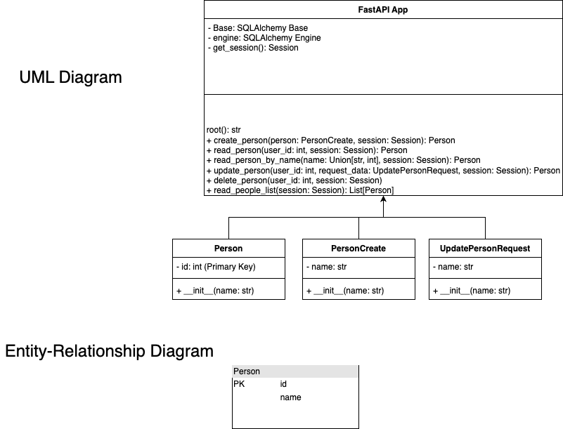

# Person API Documentation

This documentation is a detailed guide on how to use the FastAPI-based Person API created for HNG10 Stage 2. 

The API allows you to perform CRUD (Create, Read, Update, Delete) operations on a collection of persons. It also provides endpoints for retrieving a single person by their ID or name.

## Table of Contents
1. [Setup](#setup)
2. [Endpoints & Sample Usage](#endpoints) 
	   - [Create a Person](#create-a-person)
	   - [Retrieve a Person by ID](#retrieve-a-person-by-id)
	   - [Retrieve a Person by Name](#retrieve-a-person-by-name)
	   - [Update a Person](#update-a-person)
	   - [Delete a Person](#delete-a-person)
	   - [Retrieve a List of People](#retrieve-a-list-of-people)
3. [UML and E/R diagram](#uml-and-er-diagram)

## 1. Setup

Before using the API, set up the necessary dependencies and database. Make sure you have Python installed.

1. **Install Dependencies**: Create a virtual environment (optional but recommended) and install the required Python packages using pip:

	   ```bash
	   pip install fastapi sqlalchemy uvicorn
	   ```

2. **Database Configuration**: The API uses a database to store person data. Ensure that you have set up your database configuration in the `db.py` file. You should have the database URL defined in the `engine` object.

3. **Run the Application**: During development, start the FastAPI application by running the following command in the terminal from the directory containing your `stagetwo.py` file:


   ```bash
   uvicorn stagetwo:app --host 0.0.0.0 --port 8000 --reload
   ```

   Replace `stagetwo` with the actual name of your FastAPI python file if it has a different name.
   
   The API will be available at `http://localhost:8000` by default.
   
   For production, render.com was used to host the application with the following steps for deployment
   
    - clone repo from https://github.com/chunnodu/hng10stagetwo
    - select 'new > web service' from the render dashboard
    - select manual deploy
    - select commit to deploy
    - use the following command to start the service
   
 ```bash
   uvicorn stagetwo:app --host 0.0.0.0 --port 8000 --reload
   ```
   
   

## 2. Endpoints 

### Create a Person 
- **HTTP Method**: POST
- **URL**: `/person`
- **Description**: Creates a new person record with the provided name.
- **Request Body**:
  - `name` (string): The name of the person to create.
- **Response**:
  - `id` (int): The unique identifier for the created person.
  - `name` (string): The name of the created person.

#### Sample Usage

**Request** (POST `/person`):
```json
{
  "name": "Chu Nnodu"
}
```

**Response**:
```json
{
  "id": 3,
  "name": "Chu Nnodu"
}
```


### Retrieve a Person by ID 
- **HTTP Method**: GET
- **URL**: `/person/{user_id}`
- **Description**: Retrieves a person by their unique ID.
- **URL Parameters**:
  - `user_id` (int): The ID of the person to retrieve.
- **Response**:
  - `id` (int): The unique identifier of the person.
  - `name` (string): The name of the person.
#### Sample Usage
**Request** (GET `/person/3`):

**Response**:
```json
{
  "id": 3,
  "name": "Chu Nnodu"
}
```


### Retrieve a Person by Name <a name="retrieve-a-person-by-name"></a>

- **HTTP Method**: GET
- **URL**: `/person`
- **Description**: Retrieves a person by their name.
- **Query Parameters**:
  - `name` (string): The name of the person to retrieve.
- **Response**:
  - `id` (int): The unique identifier of the person.
  - `name` (string): The name of the person.
#### Sample Usage
**Request** (GET `/person?name=Chu Nnodu`):

**Response**:
```json
{
  "id": 3,
  "name": "Chu Nnodu"
}
```

### Update a Person <a name="update-a-person"></a>

- **HTTP Method**: PUT
- **URL**: `/person/{user_id}`
- **Description**: Updates the name of an existing person.
- **URL Parameters**:
  - `user_id` (int): The ID of the person to update.
- **Request Body**:
  - `name` (string): The new name for the person.
- **Response**:
  - `id` (int): The unique identifier of the updated person.
  - `name` (string): The updated name of the person.
#### Sample Usage

**Request** (PUT `/person/3`):
```json
{
  "name": "Chu Nnodu"
}
```

**Response**:
```json
{
  "id": 3,
  "name": "Chu Nnodu"
}
```

### Delete a Person <a name="delete-a-person"></a>

- **HTTP Method**: DELETE
- **URL**: `/person/{user_id}`
- **Description**: Deletes a person by their unique ID.
- **URL Parameters**:
  - `user_id` (int): The ID of the person to delete.
- **Response**: No content (HTTP status code 204) if successful.

#### Sample Usage
**Request** (DELETE `/person/3`):

**Response**: No content (HTTP status code 204).


## 3 UML and E-R Diagram
